<h1> RENU APPAREL  </h1>

  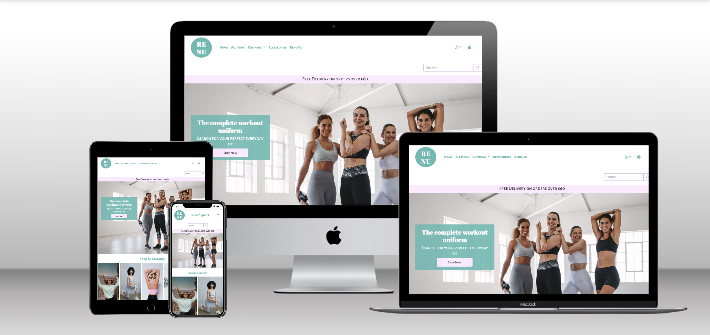
 
 <h2> About </h2>
This site has been created as part of the Code Institute Diploma. Project 5 demonstrates a full stack e-commerce site build using Django, Python, CSS, HTML and Javascript. 
The business created for the purpose of the project is RENU Apparel, a sustainable sports clothing and lifestyle brand. 
 

  Link to live Site [here](https://renu-apparel.herokuapp.com/)

  <h2> Table of Contents </h2>
  
 - Site Overview 
 - User Experience(UX)
    - The Strategy Plane
    - The Structure Plane
    - The Skeleton Plane
    - The Surface Plane
  
-  Features
  
  - Existing Features
  - Future Features
  
- Marketing Strategies
- Technologies used 
- Testing
    - Validator Testing
    - Responsive Testing
    - Manual Testing 
  
- Bugs 
- Search Engine Optimisation (SEO)
- Deployment 
    - AWS3
    - Heroku Deployment
  
 - Credits 
  
    

 
 <h2> Site Overview </h2>
 
 The goal of my project - RENU Apparel was to create a bright and energetic site that allows the user to purchase sustainable items of clothing/accessories that can be used for a workout or just for everyday comfy wear.  The site allows the user to purchase items from a number of categories including tops, bottoms, accessories and Sports bras. The user can purchases items, logged in or not. Logged in users however get access to writing reviews of products and become a member of 'renu go' - an incentive to users for being apart of the renu community. 
 
 
 <h2> User Experience </h2>
 
 <h3> The strategy Plane </h3>
 
RENU apparel is B2C - Business to Consumer business that sells sustainable activewear and accessories. In today's market, sustainable clothing pieces that are versatile and sustainable are extremely popular and cater to a wide audience. A large portion of the target audience for Renu will be women who have an interest in working out/ have an active lifestyle. The target audience will not be restricted however to just women with a very sporty lifetyle as the site also advertise the products as comfortable and sustainable. This also appeals to not only younger sporty women but also older customers who are eco conscious and value comfy clothing.
 
 <h2> User Stories </h2>
  
  - My Kanban board containing the general user stories is [here]( https://github.com/users/sarahob96/projects/2/views/2?layout=board)
  - List of in detail user stories are below
 
 <h3> Admin </h3> 

 

   1. As an Ecommerce site owner, I want to be able to update a product not only through the admin but also easily through the front end on the site.

 

  2. As a site owner, I want to easily add a new product to the site through the front end of the site.

  3. As a site owner, I want to be able to delete a product from each individual product page so products that are out of season/not available can be removed easily.

 

  4. As a site owner, I want to delete all reviews that are posted to the site if comments are inappropriate.

 

  5. As a site owner, I want to offer an incentive to members of the renugo community.

 

  6. As a site owner, I want to provide a user friendly experience to customers, allowing them to easily move around the site.

 
  7. As a site owner, I want to offer a number of ways for customers to get in touch.

 

  8. As a site owner, I want to offer users a way to sign up to a newsletter to stay up to date on the latest RENU news.

  9. As a site owner, I want to ensure only admin accounts have access to modifying products.

 <h3>Customer </h3>

 

  1. As a customer, I want to be aware of what is on offer immediately after landing on the home page.

 2. As a customer, I want to navigate easily around the site so I can find what I'm looking for quickly

 3. As a customer, I want to see what products are available to me and individual product descriptions

 4. As a customer, I want to be able to sort products by price/name to help my search

 5. As a customer, I want to be able to choose my specific size when buying clothing items

 6. As a customer, I want to be able to add products to the shopping bag and see a bag preview.

 7. As a customer, I want to be able to adjust the item quantity in my shopping bag before reaching the checkout.

 8. As a customer, I want to be able to easily checkout my items via the checkout form.

 9. As a customer, I want to view my order confirmation after purchase.

10. As a customer, I want to be able to purchase without having an account if it is a one time purchase 

11. As a customer, I want to be able to easily register an account
 
12. As a customer, I want to sort through specific categories to narrow down my search
 
13. As a customer, I want to be able to use a search function to type in key words to find what I'm looking for
 
14. As a customer, I want to sign up to the site newsletter so I can keep up to date with the latest news/offers.
 
15. As a customer, I want to be offered an incentive to shop and return a happy customer

16. As a customer, I want to be able to read reviews on other products to keep informed on my purchases
 
17. As a customer, I want to write a review of products I have recieved to inform other customers

18. As a customer, I want to be able to edit or delete my review I have posted
 
19. As a customer, I want to be able to follow the site on social media 
 
20. As a customer, I want to be able to contact the company if I have any queries about my order etc

 
  <h3> The Scope Plane </h3>
  
While designing the project, I wanted the user to have a positive experience while on the site, both UX and mood wise. A website has the ability to influence a persons mood based on the theme/design of the site and the layout used. 
To provide a positive experience while on the site, the responsive navigation bar and links in the footer allow for the user to access all parts of the site easily.
  
 A number of features will be used to provide the user with a positive experience.
  
  1. The site navigation bar will include a link to all product categories, the shopping bag, profile, and login/logout/register features 
  
 2. A search bar will be placed in the header of the site to allow the user to search for products on any page of the site.
  
 3. A landing page with a striking hero image that conveys to the user what the site is for.
  
 4. A Custom 404 page that appears if the user stumbles upon a page that is not available
  
 5. A Products page that displays all products, and the option to view specific categories
  
 6. Product information for individual items will be display on the individual product pages.
  
  7. A user profile page will display the users information that can be used in future orders.
  
  8.  Responsive design so users get a pleasant viewing experience across all devices.
 
  9. A reviews section that will allow users to leave their opinion of products
  
 10.  A contact page that will let the users reach out to the store.
 
 
  <h3> The Structure Plane </h3> 
  
When the user arrives on site, they will be greeted with a bright and energetic hero image below a clear and concise nav bar. A search bar will be display to the user at the top of the site allowing for the user to quickly find what they are looking for without having to browse.
The user will have the ability to filter the items by price and name and also look for a product by category of choice.
  
Users will have the option to add items to their bag and checkout without having to create an account. However, only signed in 'members' have access to writing reviews and to the exclusive 'renu go' online community. 
  
Anytime an item is added to the bag, a user is logged in/out, the user will recieve a pop up message to inform them that the task was completed.
                       
The site has the following apps
  1) Home
  2) Products - contains all product information- including product reviews
  3) Profile 
  4) Bag 
  5) Checkout
  6) Information - contains the contact us information and the renu go membership page
  
  
  <h3> The Skeleton Plane </h3>
  
  <h4> Wireframes </h4>
  
  MAIN PAGE 
  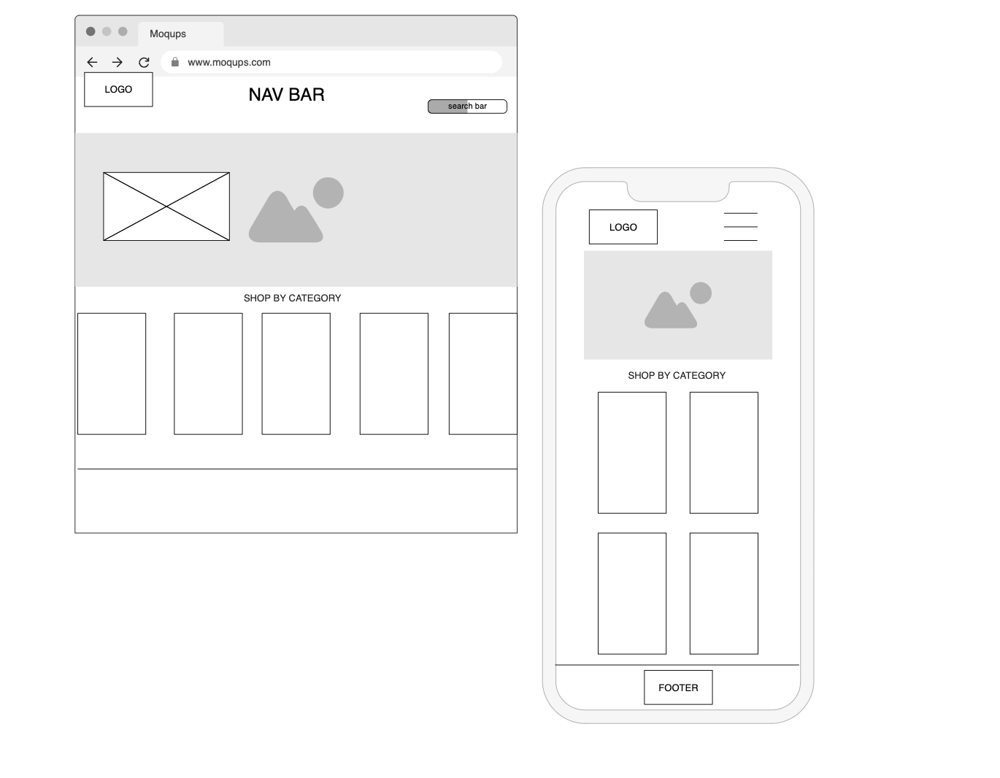  
  
  PRODUCT PAGE
  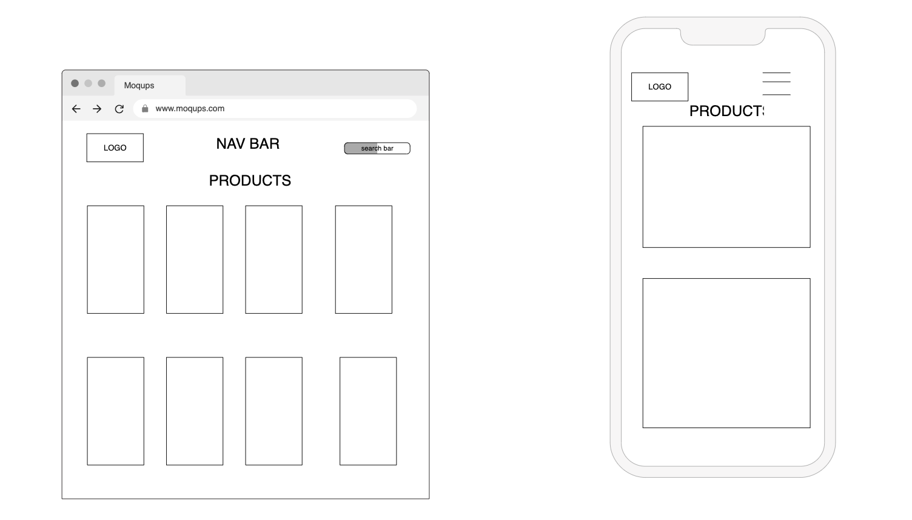  
  
  PRODUCT INFORMATION
  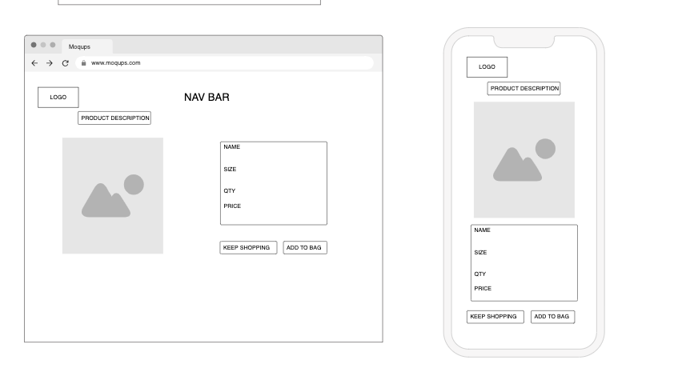   
  
  BAG 
  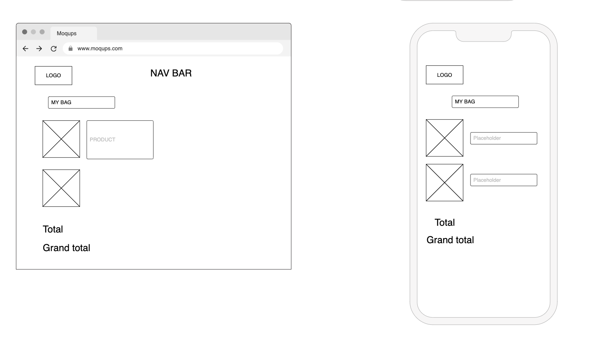    
  
  CHECKOUT
  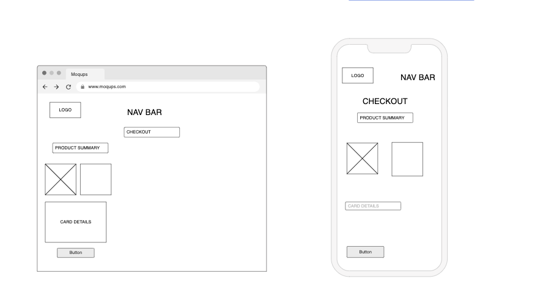   
  
  <h4> The Database </h4>
  
  - Throughout development I used SQLite as this is the default database used when using django. When deployed on Heroku, PostgreSQL database is used. 
  
  <h5> Database Schema </h5>
  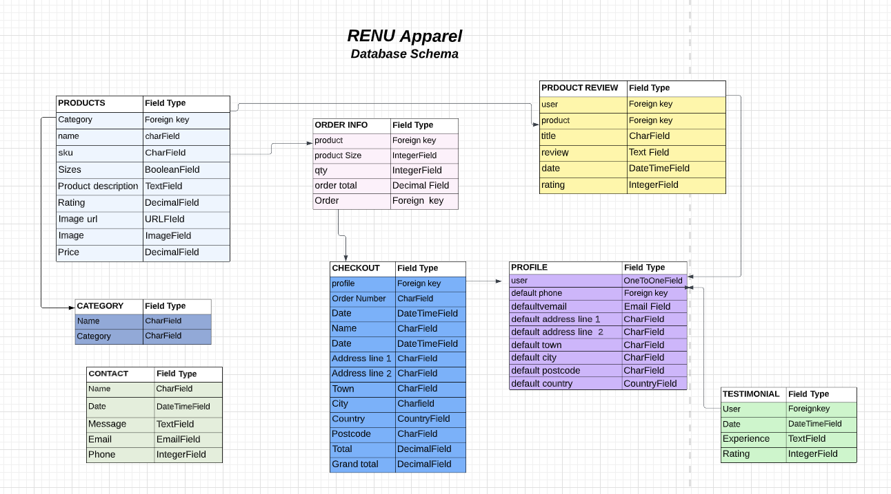  

  <h3> Models </h3>
  
  The following models are used for the site: 
  <h3> The Order model </h3>
    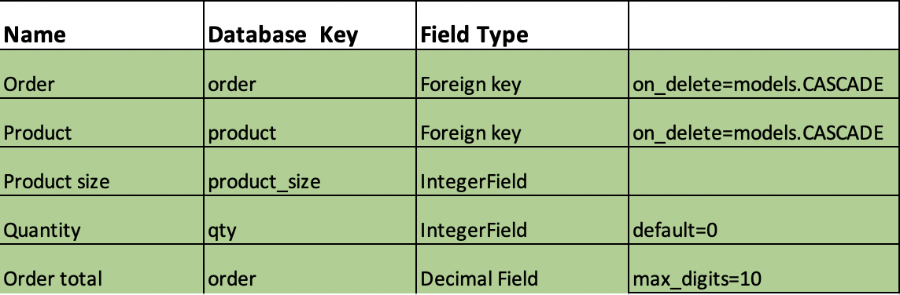  
  
  <h3> Product Model </h3>
    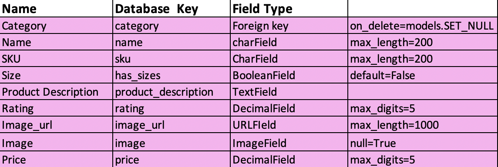 
    
  <h3> Contact Model (custom) </h3>
    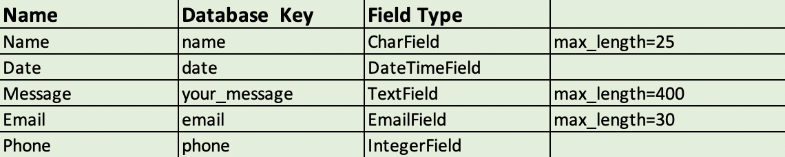
    
  <h3> Checkout Model (custom- adapted) </h3>
    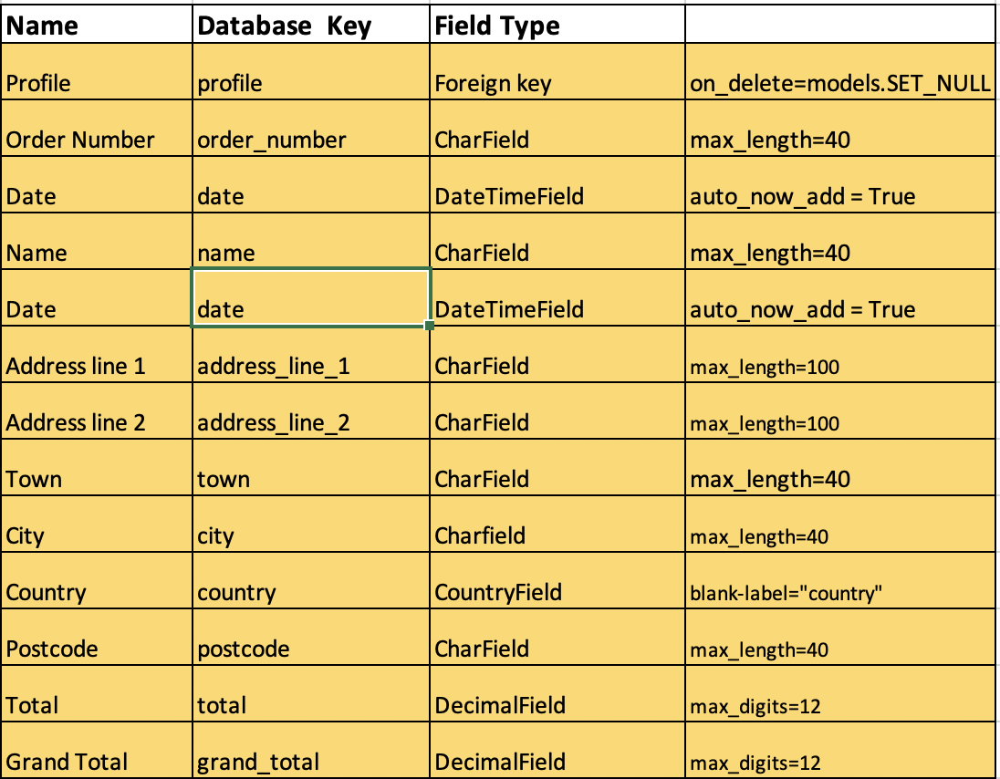 
    
  <h3> Category Model </h3>
    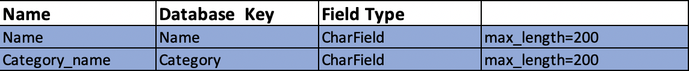
    
   <h3> Order Model </h3>
        
     
  <h3> Profiles Model </h3>
  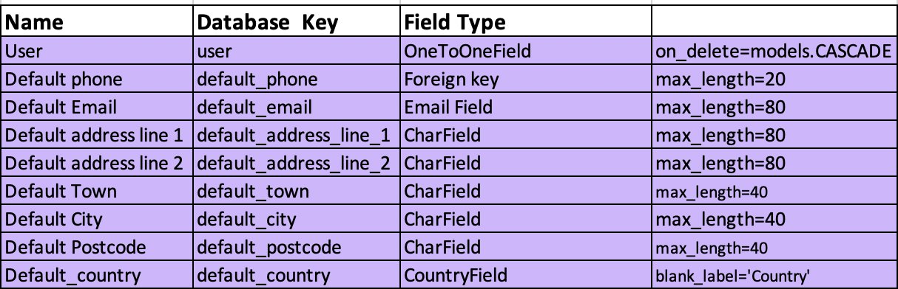  
    
  <h3> Review Model (custom) </h3>
    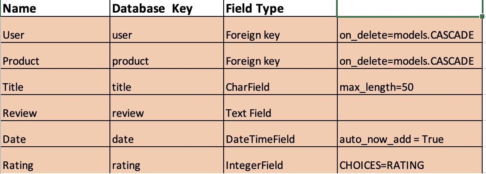
    
  <h3> The Surface Plane </h3>
  
  <h4> Colour Scheme </h4>
  
  My main vision for the site was to be bright and energetic to effectively convey the active and positive experience one has when wearing and using the RENU products The colours used on the site therefore were bright but definate. I used Colourspace to generate a palette that was then applied to the site.
  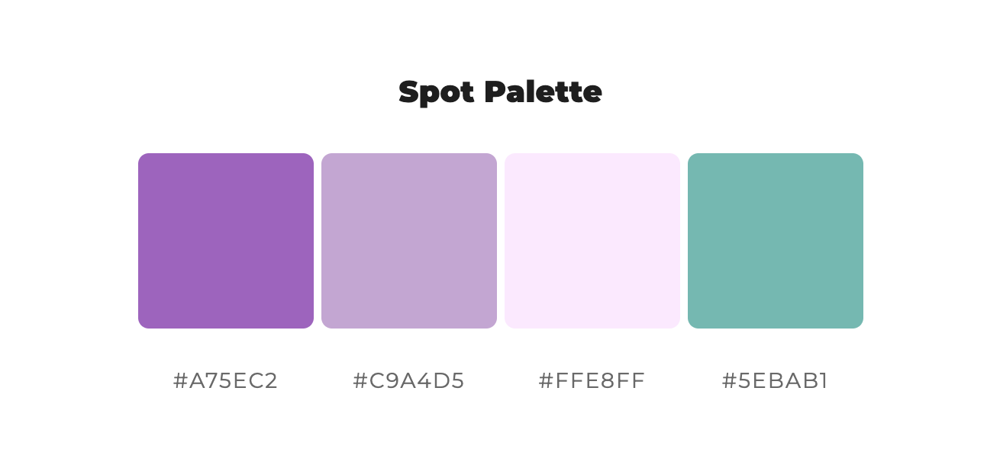
  
  - The light aqua green colour was used most across the site #5EBAB1.
  - A light pink was used throughout the site for the background colours of buttons and in the footer ##FFE8FF.
  - A lilac purple #C9A4D5 was then used sparingly acrossed the site also.
  
  <h4> Typography </h4>
  
 The font families used across the site was 'Alegreya Sans SC'' and  'Abril Fatface'. The Abril Fatface font gives a fancy and eye catching look to the site and is used to draw the attention of the user to the main features used on the site.
  
  <h4> Favicon </h4>
   - I created a Favicon on the favicon site incorporating the most used colour of the site.
  
  <h4> Images </h4>
  
  - Images used were gotten across a number of stock photo sites including
     - Shutterstock
     - Pexels
     - Unsplash 
     - Pixabay
  
  
  <h2> Features </h2>
  
  <h3> Current Features </h3>
 
 Authenicated User
 

  - The 'django-allauth' python package was used on the site to create the login, logout, register and password-change features.
 
  - Navigation bar
     - The nav bar is one of the main site features as it is visible from across the whole site.   On smaller devices it shrinks down into a collapsable menu that opens into a dropdown menu when clicked on. It contains links to most elements of the site, allowing for easy navigation throughtout the site
  
  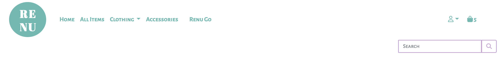
  
  - Search bar
     -  The search bar is positioned at the top of the site just below the nav bar. It allows the user to quickly search for an item if they already have something in mind and avoids having to browse.
    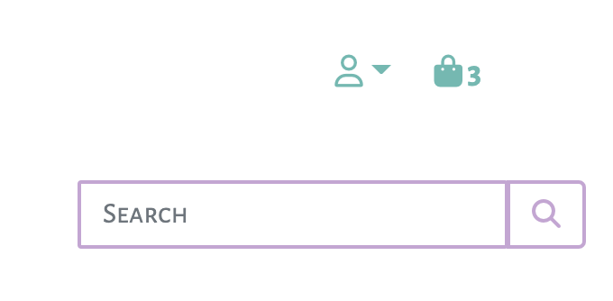
  
  - Hero Image
    - The striking hero image is displayed to the user as they reach the site. Its a bright and energetic photo that conveys the feeling of the site and the products to the user instantly. The group photo of friends doing a workout conveys the theme of the site instantly to the user. The hero image text also does this stating 'uniform' and 'everyday fit'. Both modern day terms used to describe an outfit. 
    
  
  - Shop by Category
    - Below the hero image is the 'shop by category' section of the home page. On large screens it displays as 5 different sections showing all 5 shopping categories - bottoms, sweatshirts, accessorties, tops and sports bras. On smaller devices this decreases down to 4 cateogories for UX purposes. This quickly and effectively displays to the customer whats on offer from the store.
  
    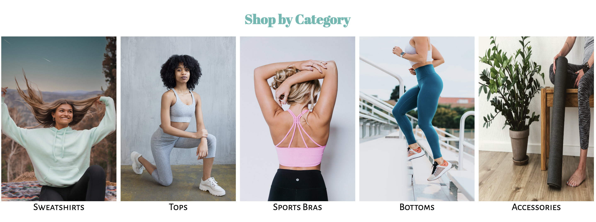

 - Most Popular feature
   - On the home page, there is a 'bestselling' feature. This provides the user with more knowledge of what is popular by other users
   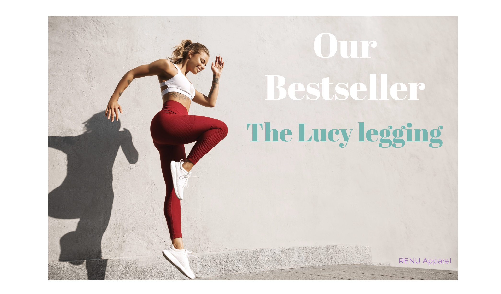
  
  - About 
     - The link to the about page can be found in the footer. This gives the user a quick synopsis of what the company is all about, allowing the user to feel more connected to the brand, its owners and its eco friendly message.
  
  - Review
     - The review portion of the site can be found on the individual product pages. Below the product, previously submitted reviews are displayed to all users. However, logged in users can only leave reviews. 
  
    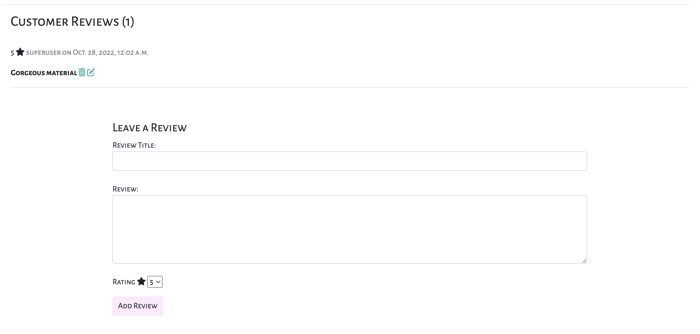
  
  
  - Renu go - Member Exclusive
    - An incentive to keep customers returning and remaining a loyal customer of the brand.
  
    - 'RENU go' is the members only page where users can get access to free workouts taking place in dublin across the following  month - December in this case. The two events listed both advertise the event and its details. Exclusive information - including upcoming products are also listed on this page.
  
  
    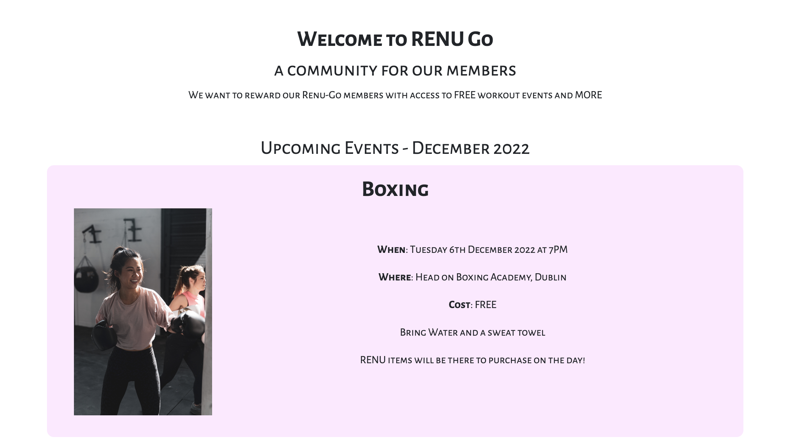
  
  - Guest
    - Users that remain on site without logging in (guest users) can still make orders and look at reviews but do not have the ability to leave reviews or check out exclusive content.
    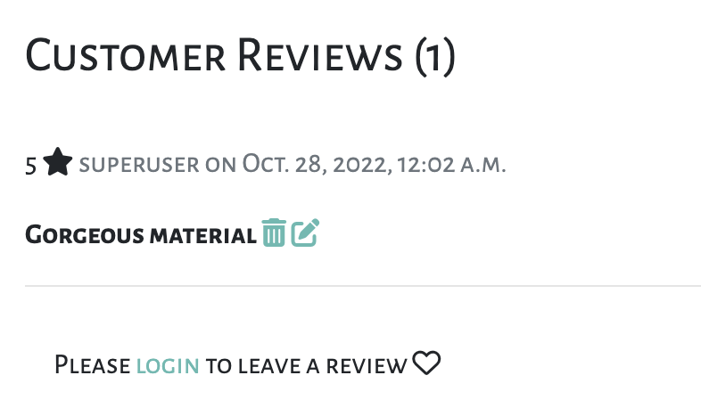
  
  - User Account
    - Logged in users have access to the exclusive renu go page and can leave / edit their review.
    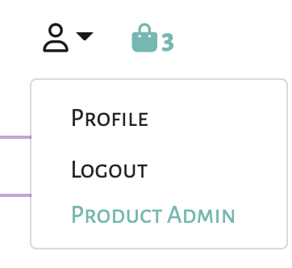
  
  - Admin Account
    - Admin users (site owners) have superuser only access to add/delete/edit products on the front end of the site.
    - They also have the ability to remove other users reviews if deemed necessary.
  
    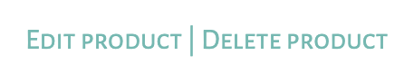
  
  - Footer
     - The footer contains links to social media accounts - Facebook, Instagram and Twitter.
     - A input box is also displayed in the footer to allow users to signup to the newsletter.
  
  <h2> Marketing Strategies </h2>
 
  - A number of marketing questions were asked to my peers and family to gather information that would be deemed as necessary to when setting up a marketing strategy for an activewear site.
  
  1) What brands would you usually go to when you're looking for active/comfy clothing?
       - Women's best
       - Gymshark
       - Gym and Coffee
       - Lulu lemon
  
  2) What social media platforms do you mostly find these kind of products on?
        - Instagram
        - Tik tok
        - Youtube Hauls
  
  3) What would be a good price point for a sustainable and versatile piece of clothing?
        - 30 - 50 euro depending on item of clothing
  
  
  4) From all forms of media - social, tv, radio and newspapers, where would you find most brand advertisments?
         - Social media, mainly content creators.
  
  
  - In today's market, Social media is the biggest platform for advertising a business.
  - Content creators would be a great choice of marketing for RENU clothing.
  - Content creators get the product out there, mainly creating video content for the brand.
  - The target market is also more on the younger side, with most young age groups using social media to find out about the latest brands and trends. 
  - Tik tok has fast become the most popular social media platform for all forms of content.
  
  
  <h3> Renu Marketing  </h3>
   A number of marketing techniques were used on site 
  
  <h4>  Instagram </h4>
  An instagram site was created for Renu Apparel
  
   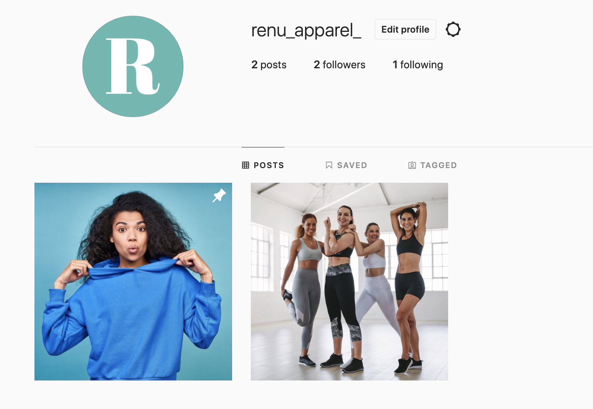  
  
  <h4> Facebook </h4>
  A Facebook page was also created for the site.
   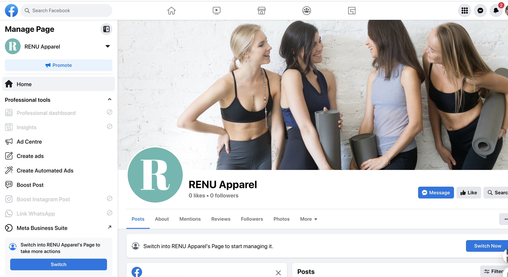
  
  <h4> Subscription Newsletter </h4>
  A newsletter subscription form was created using MailChimp. This can be found in the footer.
   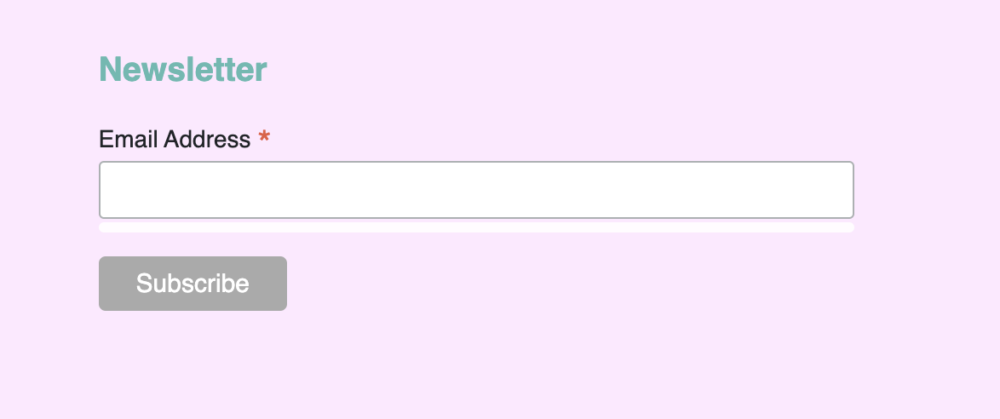
  
  
  <h3> Features to be implemented in the future </h3>
  
  The following features could be added to the site in the future:
  
  - Discount codes to allow members recieve a discount on purchases
  - A Gallery feature to show people RENU events
  - "seen on" feature for photos uploaded by customers wearing renu apparel
  
  
  <h2> Technologies Used </h2>
  
  <h3> Frameworks and Extensions </h3>
  
  - Github - provides hosting for software development version control using GIT. Contains the repository of this project.
  
  - Gitpod - Gitpod hosts the coding space where the project was built before being committed to github repository.
  
  - Heroku - Cloud platform as a service (PaaS) that enables developers to build, run, and operate applications entirely in the cloud.
  
  - Django - High level python web framework used to build the foundations of the project
  
  - Bootstrap - a free, open source front-end development framework for the creation of websites and web apps. Bootstrap provides a collection of syntax for template designs.  
  
  - Stripe - Allows for payments to be made and recieved over the internet.
  
  - jQuery - fast, small, and feature-rich JavaScript library. It is designed to simplify HTML DOM tree traversal and manipulation 
  
 - Font awesome - Used for all of the icons throughout the site including social media and delete/edit review buttons
  
  
  <h3>  Database </h3>
  - Heroku Postgres - Database used on Heroku.
  
  <h3> Libraries </h3>
   - HTML
   - CSS
   - Python 
   - Javascript
  
  
  <h2> Manual Testing - Features </h2>
  
   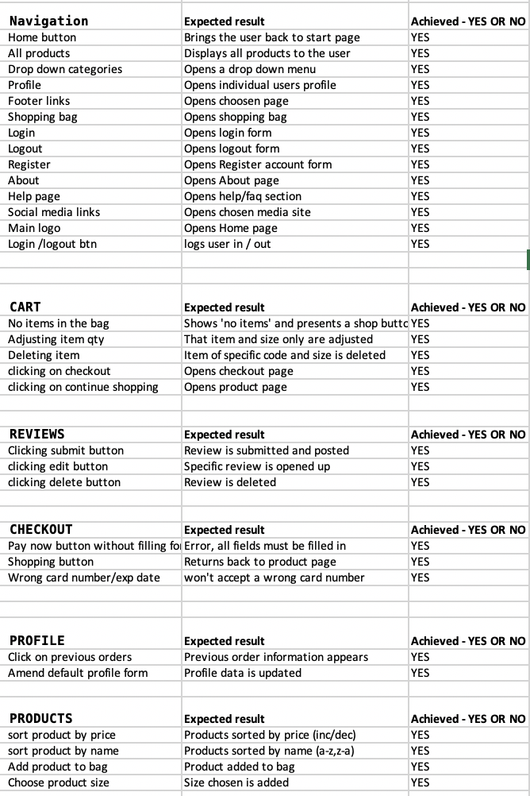
  
  <h2> User Stories - Validation </h2>
  

"As an Ecommerce site owner, I want to be able to update a product not only through the admin but also easily through the front end on the site."

- This feature is accessible on the individual product pages for admin/superusers only. They can edit these products easily from the front end rather than through the admin panel.
 

" As a site owner, I want to easily add a new product to the site through the front end of the site."

- This feature is available only to admin users. Once a user is logged in they will see in the profile menu an option for product admin. Regular customers will be greeted with a message to say the feature is for admin only. Admin users can then add products directly from the front end.

" As a site owner, I want to be able to delete a product from each individual product page so products that are out of season/not available can be removed easily."

- This feature is available also through the individual product pages. Admin users only will get the pop up option to delete the individual products.
- 

" As a site owner, I want to offer an incentive to members of the renugo community."

 - This feature was fulfilled by offering free workout classes and exclusive information such as products coming soon. All customers can become a member once registered with the site.

" As a site owner, I want to provide a user friendly experience to customers, allowing them to easily move around the site."

- The navigation bar is pivotal to this user story being a success. The nav bar is seen at the top of all pages and allows the user access to travel around the site easily. 

 
" As a site owner, I want to offer a number of ways for customers to get in touch."

 - The customer can get in touch via a contact form. A Phone number and links to social media pages are also given.

"As a site owner, I want to offer users a way to sign up to a newsletter to stay up to date on the latest RENU news."

- A newsletter signup box is available at the bottom of the page in the footer.

 

" As a customer, I want to be aware of what is on offer immediately after landing on the home page."

- The eye catching hero image and hero text immediately conveys the message of the site. The 'shop by category' feature on the homepage also tells the user very quickly what products/types of products are on offer.

" As a customer, I want to navigate easily around the site so I can find what I'm looking for quickly"

- The navbar allows the user to travel around the site effectively with no issues

" As a customer, I want to see what products are available to me and individual product descriptions"

- All products available are on show for the customer. Each product has their own description giving the user further insight.

" As a customer, I want to be able to sort products by price/name to help my search"

- The user can sort products by price( low to high, high to low) and from A-Z, Z-A

"As a customer, I want to be able to choose my specific size when buying clothing items"
- All clothing has the option to choose a size. Only accessories are one sized.

"As a customer, I want to be able to add products to the shopping bag and see a bag preview."

- A bag preview appears through a success toast when the user adds products to the shopping bag.

"As a customer, I want to be able to adjust the item quantity in my shopping bag before reaching the checkout."

- Their is a cart adjustment feature prior to checkout where the user can adjust the quantity of an item or delete it completely from the bag.

"As a customer, I want to be able to easily checkout my items via the checkout form."

- Once the user completes the checkout form and enters card details, they are brought to the order success page.

" As a customer, I want to view my order confirmation after purchase."

- Through the users profile, they can view previous orders, items and order total.

" As a customer, I want to be able to purchase without having an account if it is a one time purchase "
- Users can purchase without having an account but none of their information including orders will be saved. 

" As a customer, I want to be able to easily register an account"

- Customers can easily register for an account through the profile tab at the top of the page and also by clicking on the "renu go member" image on the home page. The option to sign up is also available through numerous sections of the site where non members cannot access certain features.

 
"As a customer, I want to sort through specific categories to narrow down my search

- Products are offered on the nav bar through categories aswell as 'all products'. The shop by category feature is also seen on the home page below the hero image.

"As a customer, I want to be able to use a search function to type in key words to find what I'm looking for"

- The search bar can be found on top of the site on the far right on large screens, center on small screens. The user can enter keywords that will bring up products with related product names/descriptions.
 
 
" As a customer, I want to sign up to the site newsletter so I can keep up to date with the latest news/offers."

- Users can successfully sign up to the newsletter by entering a valid email in the small pop up form in the footer.
 
 
 
"As a customer, I want to be offered an incentive to shop and return a happy customer"

- Users can easily sign up to become a member of renu-go where free classes and special offers will be advertised.

" As a customer, I want to be able to read reviews on other products to keep informed on my purchases"

- Reviews left by other customers will be seen by all users, giving them the chance to make informative decisions before purchasing items.
 
 
"As a customer, I want to write a review of products I have recieved to inform other customers"

- Customers - members only can leave product reviews underneath all products to help inform other users about the product

"As a customer, I want to be able to edit or delete my review I have posted"

- Customers have the options to edit and delete their own reviews only.
 
 
"As a customer, I want to be able to follow the site on social media "

- Social media links are provided in the footer- FB, instagram and twitter.
 
 
"As a customer, I want to be able to contact the company if I have any queries about my order etc"

- An easy to use contact form is available for email queries. A phone number and options to social accounts are also on the site.
  
  
  <h3> Code Validators </h3>
  
- HTML code was validated through the [W3 validator](https://validator.w3.org/). No major errors were returned for my HTML code  
- CSS code was validated through [W3 Jigsaw](https://jigsaw.w3.org/css-validator/)  
- Javascript code was validated through [JS Hint](https://jshint.com/)
- Python is normally validated through PEP8. At the time of validating this project, the PEP8 site was down. The Python code was checked through the problems panel through github.

<h3> Responsive Testing </h3>

- This project was tested for it's responsiveness on a number of devices including:
  - Iphone 13
  - Iphone 8
  - Macbook Pro 13"
  - Google developer tools - All screen sizes from 375 px and up.
  
<h3> Bugs </h3>

- Currently there are a few minor 'line to long' python errors. These have been left where code was affected when the text was moved to the next line.

<h3> Search Engine Optimisation (SE0) </h3>
 - Search engine optimization (SEO) is the practice of orienting your website to rank higher on a search engine results page so that your site gains more traffic. The aim is appear on the first page of Google results for search terms to reach a larger target audience. 
  
 The following meta keyword were used in my code to attract the right target audience and gain the most traffic.
  -sustainable, workout, activewear, loungewear, sports-bra, sweatshirts, bottoms, tops, renugo, dublin, irish, workout-classes, renu, renu-apparel, workout-uniform"
 
<h3> Deployment </h3>
 
 - This project was created in gitpod and deployed using Heroku.
A number of steps were carried out to ensure a successful deployment.

- The final code was pushed to github and then connected to Heroku Database.

- On the Heroku website, log in to your account once signed up.

- Click on "create new app" once logged in.

- Give the app a name and choose the correct region, USA or Europe

- Before Deployment, import os and dj_database_url at the top of settings.py. Ensure dj_database_url and psychopg2 are installed using pip. Freeze requirements into  the requirements.txt file. 

- Click on the settings tab

- Once in settings, go to the "Config Vars" 
      - add the KEY:PORT and the VALUE:8000
      -AWS_ACCESS_KEY_ID
      -AWS_SECRET_ACCESS_KEY
      -DATABASE_URL 
      -SECRET_KEY
      -STRIPE_PUBLIC_KEY
      -STRIPE_SECRET_KEY
      -USE_AWS
  
 - Get the database URL from here and use to connect the database to the app on github. 
 
- Migrate all information from the sqlite db to the postgres db using a json file that had all db information stored on it. I used this file to render my product and category information. 

- Gunicorn was installed and also added to requirements.txt.

- A Procfile was created and "web: gunicorn re_nu_apparel.wsgi:application" was added to it.

- Disable static so heroku can deploy the site without static files.

-  Go to the deployment section and click on the 'connect to Github' option

- Choose the repository name you want to deploy and click 'connect'.

- Choose between the 'automatic' and 'manual' deploys

- Finally select the branch to deploy and heroku will build the final live app.

- Files were pushed using "git push heroku main" after logging into the heroku CLI through "heroku login -i".

AWS - Amazon web services was used to store all media and static files.
- I created an account and searched for the S3 service.
- Here, I 'created a bucket' and gave it public access.
- I followed the rest of steps listed by code institute on this [page](https://codeinstitute.s3.amazonaws.com/fullstack/AWS%20changes%20sheet.pdf)
- Once my site was connected to AWS storage service, I ensured my DEBUG was set to development only so it could not be used on my deployed site.
- When all final changes were made in gitpod, I did a final 'git push heroku main' to ensure the live site was the latest version.
  
<h3> Credits </h3>
  
The Code Institute project - Boutique Ado was used to help build my project. I adapted models and views to suit my site as needed.
  
- I used a number of sports clothing sites including [Nike](https://www.nike.com/ie/?cp=72550463143_search_%7cnike%7c10564798947%7c107421904514%7ce%7cc%7cEN%7cpure%7c452146885339&ds_rl=1252249&gclid=CjwKCAiA9qKbBhAzEiwAS4yeDSCQ0_-lTRoTkFRFyhLSEM2XzUOxz9JqrBam84U56u-caiP3RaCxuhoCbMMQAvD_BwE&gclsrc=aw.ds), [Lulu lemon](https://www.eu.lululemon.com/en-lu/home?CID=Google_IRL_SRCH_Branded_lululemon&gclid=CjwKCAiA9qKbBhAzEiwAS4yeDYNnXDaiGT6mIsS5yPyX7vIjfpOD7TXWOn9HQtgpvzQR7OnKa8lX9hoCaP8QAvD_BwE&gclsrc=aw.ds) and [gym plus coffee](https://gympluscoffee.com/collections/womens?gclid=CjwKCAiA9qKbBhAzEiwAS4yeDci01O-m5p7Ie96SymiOgo1rzawB_l3js_kIXNoDtZ9fbsca6Ce3LBoCY7sQAvD_BwE) to get product descriptions for my products.
  
- A sitemap was generated on [XML Sitemap Generator](https://www.xml-sitemaps.com/details-renu-apparel.herokuapp.com-3deb2a24e.html).
- Stack overflow and the Code institute slack group chats came in very useful with specific issues.
  
 <h4> Media </h4>
  
Images were sourced from:
 - [shutterstock](https://www.shutterstock.com/explore/eu-stock-assets?c3apidt=p11181026076&gclid=CjwKCAiA9qKbBhAzEiwAS4yeDfr383MfpXWkxs2sNZ86ta6tPij_v5XLUdRgYc8BWcsrJdDZr8vTGBoC5y4QAvD_BwE&gclsrc=aw.ds&kw=shutterstock)
 - [Pexels](https://www.pexels.com/) 
 - [Unsplash](https://unsplash.com/)
 - [Pixabay](https://pixabay.com/)  
 - [Favicon](https://favicon.io/) was used to create the site icon image 
 
<h4> Style </h4>
  
  - [Google fonts](https://fonts.google.com/about)
  - [Font Awesome](https://fontawesome.com/)
  - [Bootstrap](https://getbootstrap.com/)
  - [Colorspace](https://mycolor.space/)

<h2> Acknowledgements </h2>
  
  I'd like to thank all those who have supported me while completing this project and all previous ones also. Thank you to all the tutors at the Code Institute for helping me sort issues that I could not figure out. It's been a tough but rewarding course and I have gained so much knowledge and have learned so much.
